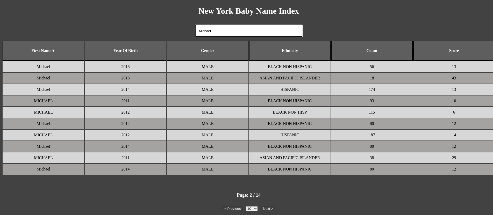

# New York Baby Name index

[DATASET: Popular Baby Names in New York](https://catalog.data.gov/dataset/popular-baby-names)

- Conversion of CSV data to DB Entity using `Spring-batch`
- CRUD/REST Interface over the data
- Searching and Sorting functionality

> Why ? Easter Weekend...

## Back End
###  `new-york-babies`
- Maps CSV (50k records) to DB using **Spring Batch**
- **CRUD** layer over BabyIndex:
  - `Sorting`
  - `Pagination`
  - `Searching`

### Development
- `Start` (Port: `8080`)

## Front End
- `React`
- `Chakra UI`
- `TanStack Table`
 
### Development
- `cd new-york-babies-web`
- `npm i`
- `npm run start` (Port: `3000`)
